# Student Databse Application

## Explictly imported Modules
* **Tkinter**
    * Tkinter is a Python binding to the Tk GUI toolkit. It is the standard Python interface to the Tk GUI toolkit, and is Python's de facto standard GUI
* **sqlite3**
    * SQLite is a C library that provides a lightweight disk-based database that doesn’t require a separate server process and allows accessing the database using a nonstandard variant of the SQL query language. Some applications can use SQLite for internal data storage. It’s also possible to prototype an application using SQLite and then port the code to a larger database such as PostgreSQL or Oracle.

```python
from tkinter import *
import sqlite3
from tkinter import messagebox
```


### Home Screen

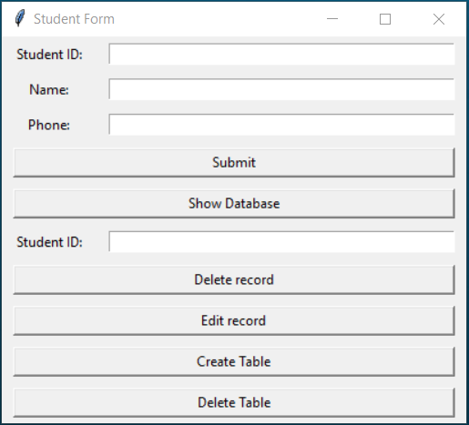
```python
root = Tk()                             # Main Window
root.title('Student Form')              # Window Title

l1 = Label(root,text='Student ID:')
l2 = Label(root,text='Name:')
l3 = Label(root,text='Phone:')
l4 = Label(root,text='Student ID:')

sid = Entry(root,width=50)
name = Entry(root,width=50)
phone = Entry(root,width=50)
rid = Entry(root,width=50)

l1.grid(row=0,column=0,padx=10,pady=5)
sid.grid(row=0,column=1,padx=10)
l2.grid(row=1,column=0,pady=5)
name.grid(row=1,column=1)
l3.grid(row=2,column=0,pady=5)
phone.grid(row=2,column=1)
Button(root,text='Submit',command=submit).grid(row=3,column=0,columnspan=2,sticky=W+E,padx=10,pady=5)
Button(root,text='Show Database',command=query).grid(row=4,column=0,columnspan=2,sticky=W+E,padx=10,pady=5)
l4.grid(row=5,column=0,pady=5)
rid.grid(row=5,column=1)
Button(root,text='Delete record',command=delete).grid(row=6,column=0,columnspan=2,sticky=W+E,padx=10,pady=5)
Button(root,text='Edit record',command=edit).grid(row=7,column=0,columnspan=2,sticky=W+E,padx=10,pady=5)
Button(root,text='Create Table',command=create).grid(row=8,column=0,columnspan=2,sticky=W+E,padx=10,pady=5)
Button(root,text='Delete Table',command=droptable).grid(row=9,column=0,columnspan=2,sticky=W+E,padx=10,pady=5)

root.mainloop()
```
### Creating Table
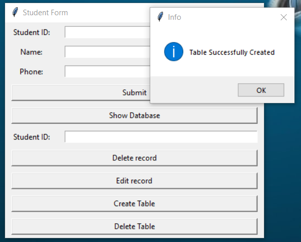

> **Note :** The **student.db** file will be created in the same directory of the source code

```python
def create():
    # Creating table
    con = sqlite3.connect('students.db')
    c = con.cursor()
    try:
        c.execute('''create table students(
        sid TEXT(10),
        name TEXT(20),
        phone INT
        )''')
        messagebox.showinfo('Info','Table Successfully Created')
    except sqlite3.OperationalError:
        # When Table already exists "sqlite3.OperationalError" is raised
        # We handle it by showing a Alert Dialog Box 
        messagebox.showerror('Error','Table Already Exists')
    c.close()
    con.commit()
    con.close()
```

### Inseting Records into table
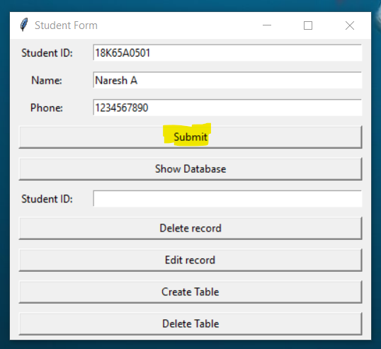
```python
def submit():
    # Inserting Record into table
    con = sqlite3.connect('students.db')
    c = con.cursor()
    try:
        c.execute('INSERT INTO students VALUES(:sid,:name,:phone)',{
            'sid':sid.get(),'name':name.get(),'phone':phone.get()
        })
    except sqlite3.OperationalError:
        messagebox.showerror('Error',"Table Doesn't Exist")
    c.close()
    con.commit()
    con.close()
    sid.delete(0,END)
    name.delete(0,END)
    phone.delete(0,END)
```
### Fetching records from student.db
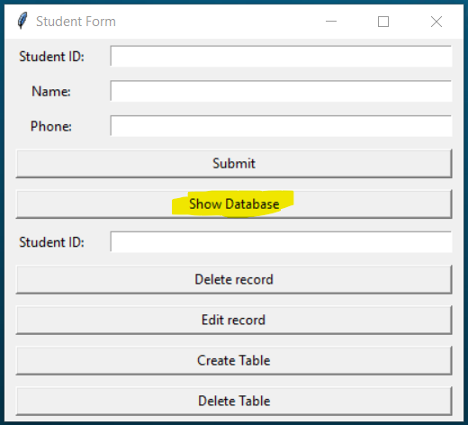
> SQL Query : ```SELECT * FROM STUDENT;``` will be executed when **show Database** Button is Pressed.

### Fetched records will be presented on top level window
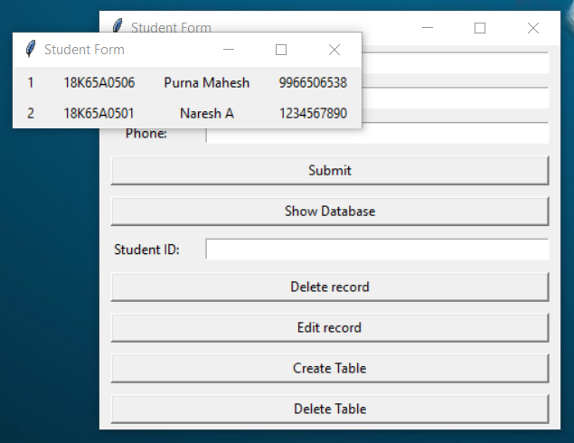
```python
def query():
    # Fetching Records from Student table
    con = sqlite3.connect('students.db')
    c = con.cursor()
    try:
        o = c.execute('SELECT oid,* from students').fetchall()
    except sqlite3.OperationalError:
        messagebox.showerror('Error',"Table Doesn't Exist")
        c.close()
        con.commit()
        con.close()
        return
    if len(o)==0:
        messagebox.showinfo('Info','Table consists 0 record(s)')
        c.close()
        con.commit()
        con.close()
        return
    top = Toplevel()
    for i in range(len(o)):
        Label(top,text=o[i][0]).grid(row=i,column=0,pady=3,padx=10)
        Label(top,text=o[i][1]).grid(row=i,column=1,pady=3,padx=10)
        Label(top,text=o[i][2]).grid(row=i,column=2,pady=3,padx=10)
        Label(top,text=o[i][3]).grid(row=i,column=3,pady=3,padx=10)
    c.close()
    con.commit()
    con.close()
```
### Deleting record from table 
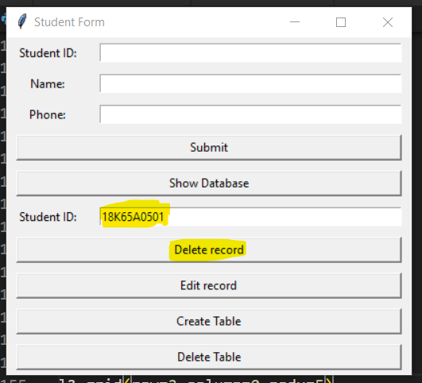
> Enter student-id in the text-field under the **show Database** Button and press **Delete Record** Button
```python
def delete():
    # Deleting record from table
    con = sqlite3.connect('students.db')
    c = con.cursor()
    try:
        c.execute('DELETE FROM students WHERE sid=:place',{
        'place':rid.get()        
        }).fetchall()
    except sqlite3.OperationalError:
        messagebox.showerror('Error',"Table Doesn't Exist")
    rid.delete(0,END)
    c.close()
    con.commit()
    con.close()
```

### After Deleting a record
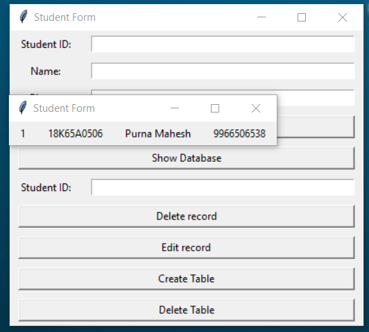
> Fetched records after deletion of record with student-id **18K65A0501**

### Editing Records
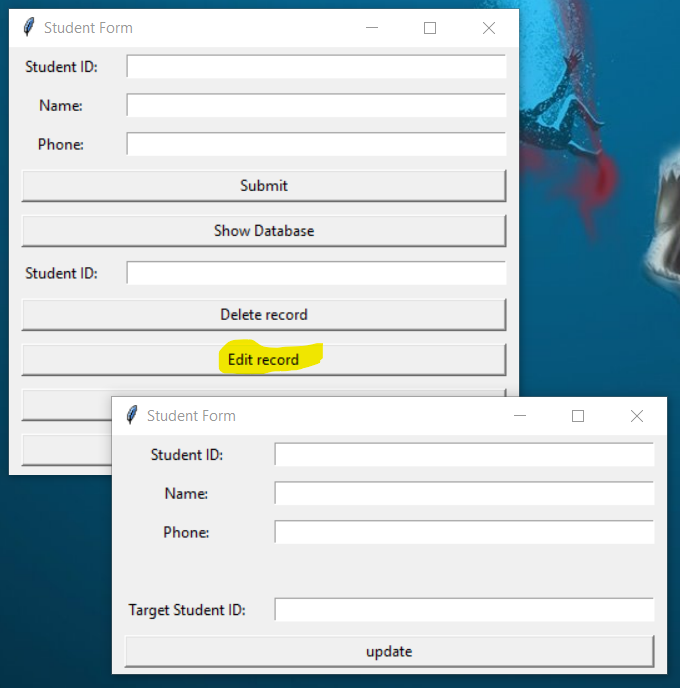
> By Clicking on **Edit record** Button, This window opens

```python
def edit():
    """Code for creating top level window to be poped when "Edit Record" Button Pressed""" 
    global sid2,name2,phone2,rid2
    top = Toplevel()
    l1 = Label(top,text='Student ID:')
    l2 = Label(top,text='Name:')
    l3 = Label(top,text='Phone:')
    l4 = Label(top,text='Target Student ID:')

    sid2 = Entry(top,width=50)
    name2 = Entry(top,width=50)
    phone2 = Entry(top,width=50)
    rid2 = Entry(top,width=50)

    l1.grid(row=0,column=0,padx=10,pady=5)
    sid2.grid(row=0,column=1,padx=10)
    l2.grid(row=1,column=0,pady=5)
    name2.grid(row=1,column=1)
    l3.grid(row=2,column=0,pady=5)
    phone2.grid(row=2,column=1)

    Label(top).grid(row=3,column=0,pady=5) # divider
    l4.grid(row=4,column=0,padx=10,pady=5)
    rid2.grid(row=4,column=1)
    
    Button(top,text='update',command=update).grid(row=5,column=0,columnspan=2,padx=10,pady=5,sticky=W+E)
```
### Update Target Record
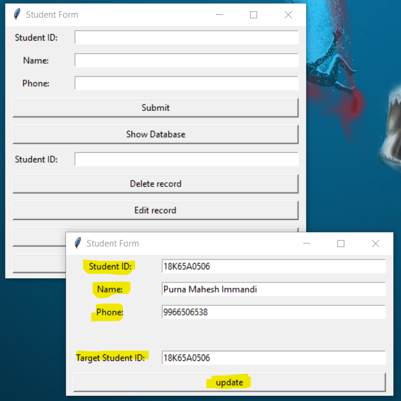
> This window consists of  **student ID**,**Name**,**Phone** and **Target Student ID** Text Fields . The **Target Student ID** is the record to be modified.
Once you filled all fields press **Update** Button

```python
def update():
    # Update existing Records
    con =sqlite3.connect('students.db')
    c = con.cursor()
    c.execute('UPDATE STUDENTS SET sid=:id,name=:n,phone=:p WHERE sid=:r',{
        'id':sid2.get(),
        'n':name2.get(),
        'p':phone2.get(),
        'r':rid2.get()
    })
    c.close()
    con.commit()
    con.close()
    sid2.delete(0,END)
    name2.delete(0,END)
    phone2.delete(0,END)
    rid2.delete(0,END)
```
### After Modifing 
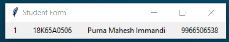
> You can notice I added my last name

### Trying to Create table 
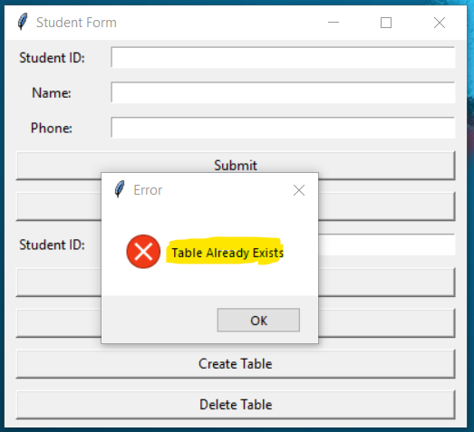
> If Student Table already exists and you tried to create anyway , the system Warns us 

### Droping Table
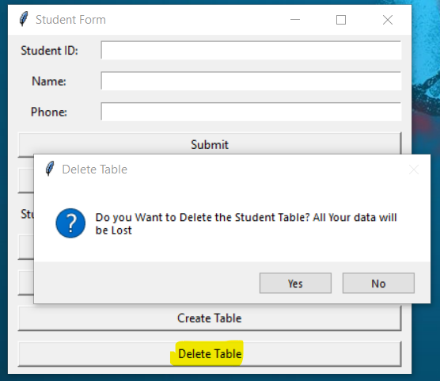
> When you try to drop the table , it asks for conformation , if you press **yes** table will be droped.

```python
def droptable():
    # Droping table
    try:
        con = sqlite3.connect('students.db')
        c = con.cursor()
        try:
            if messagebox.askyesno('Delete Table','Do you Want to Delete the Student Table? All Your data will be Lost'):
                c.execute('drop table students')
        except sqlite3.OperationalError:
            # When we droping a table which doesn't exist exception will be rised , we show a alert box
            messagebox.showerror('Error',"Table Doesn't Exist")
        c.close()
        con.commit()
        con.close()
    except:
        pass
```
### Trying to Drop table
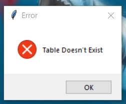

> if table doesnt exist and you clicked on **Delete Table** You will see this warning
